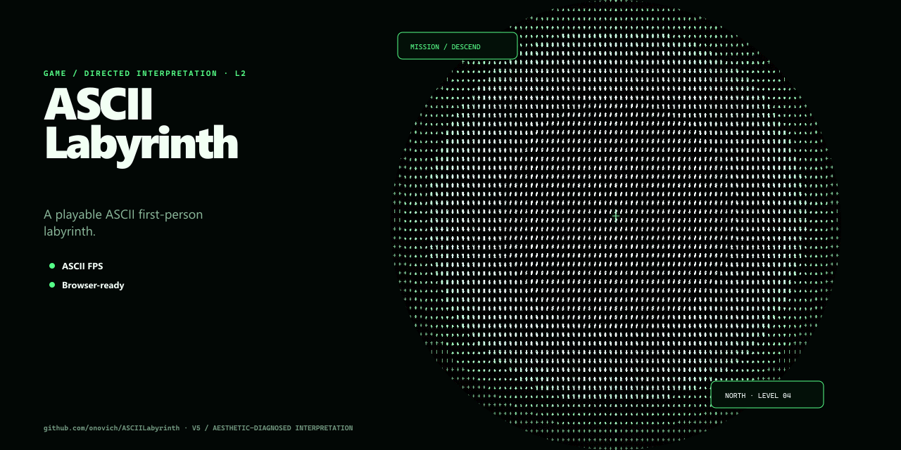

# ASCIILabyrinth

[简体中文](README.zh-CN.md)

[Play online](https://game.onovich.com/ASCIILabyrinth/)

ASCIILabyrinth is a playable first-person maze shooter rendered as a field of ASCII characters.



## About

Explore a procedurally assembled facility, survive hostile encounters, find the key and access code, and reach the exit. The game keeps a real 3D scene underneath while a WebGL post-processing pass turns the final image into terminal-like ASCII output.

## How to play

- Click the game view to capture the pointer.
- Use `WASD` to move and the mouse to look around.
- Use the left mouse button to fire.
- Follow the HUD and radio messages, recover the required key and code, then locate the exit.

## Features

- A complete key, code, and exit objective loop.
- Procedural facility generation and two weapons.
- ASCII WebGL rendering with a matching terminal-style HUD.
- Web Audio feedback and local game assets.
- Level and model editor data that can be converted into runtime content through a shared schema.

## Development

Install dependencies and start the Vite server:

```bash
npm install
npm run dev
```

Run the main build and smoke checks:

```bash
npm run validate
npm run visual-smoke
```

`npm run verify` runs the build, logic smoke checks, and visual smoke workflow together.

## Project structure

- `origin/index.html` is the authoritative gameplay runtime.
- `origin/shared/` contains shared data and UI contracts used by the game and editors.
- `scripts/sync-runtime.mjs` copies the runtime into `public/runtime/` before development and production builds.
- `src/` contains the Vite and React shell around the runtime.

## Status

The game is playable and has extensive build, smoke, and visual-smoke checks. The gameplay runtime is still concentrated in `origin/index.html`; further extraction is possible, but should preserve the working game and editor contracts.

## License

No open-source license is currently included in this repository.
